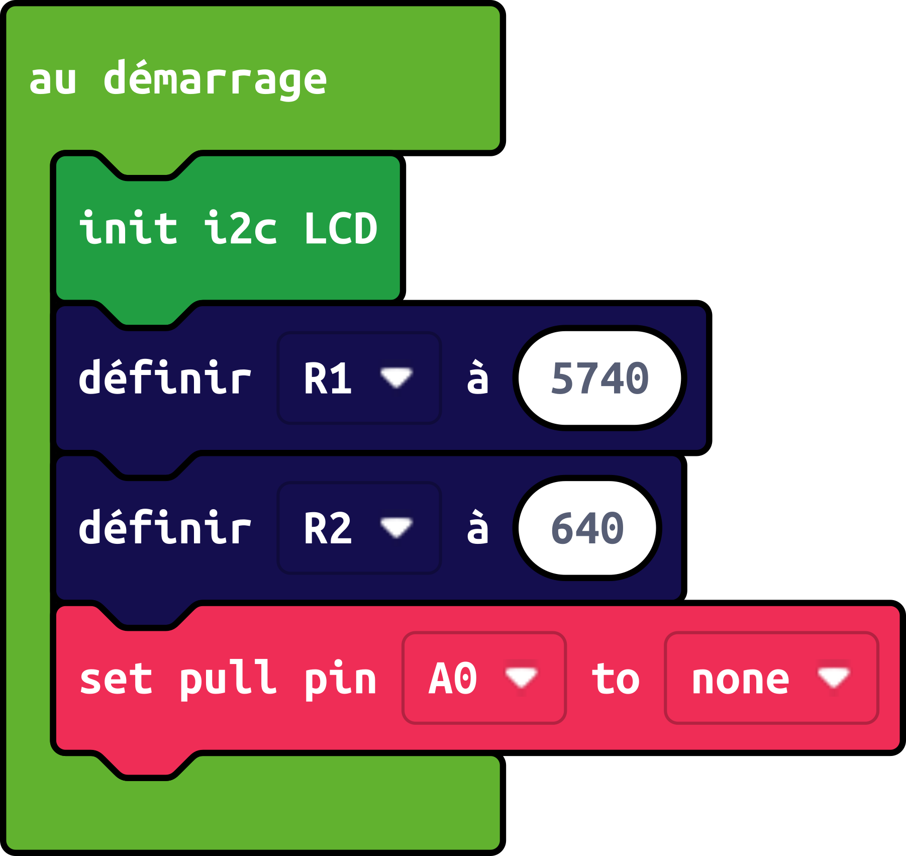
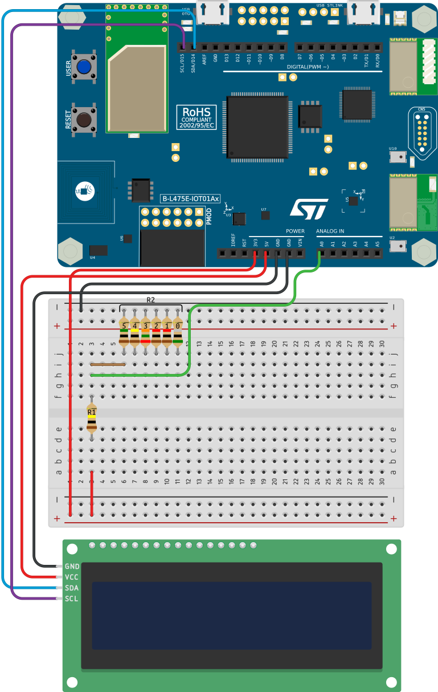

\tableofcontents

# Présentation

Comment mesurer une tension, une résistance ? Le but de cette activité est d'expliquer le fonctionnement du montage et des phénomènes électriques impliqués lors de l'utilisation d'un multimètre (voltmètre + Ohmmètre) pour effectuer des mesures, en passant par la création d'un multimètre numérique simplifié basé sur une carte électronique de type STM32.

## Liste du matériel

Afin de réaliser les différentes expériences, plusieurs composants électroniques vont vous être fournis : 

- Une carte électronique [STM32 IoT Node](https://www.st.com/en/evaluation-tools/b-l475e-iot01a.html)
- un écran LCD
- un ensemble de résistances de différentes valeurs
- une breadboard
- des câbles Dupont

# Fabrication du voltmètre numérique

## Capacités de mesure de la carte

La carte électronique fournie possède un ADC, pour *Analog to Digital Converter*, ou convertisseur analogique numérique en français. Ce composant, lorsqu'on applique une tension à une de ses broches (notées de A0 à A5 sur la carte), convertit cette tension en valeur numérique comprise entre 0 et 1023.\

\warningbox{\fontspec{Clara} \fontsize{12}{14} Par ailleurs, la carte, au dela d'une certaine tension (5V), peut subir des dommages, voire être détruite. Il faut donc faire attention à ne pas dépasser cette limite.}

### Problématique

la carte est capable de mesurer des tensions, et ce jusqu'à 3.3V. Mais un voltmètre mesurant des tensions dans cette plage est très restrictif.
Comment mesurer des tensions supérieures à 3.3V ?

### Solution

Afin de mesurer des tensions supérieures à 3.3V, on peut utiliser un pont diviseur de tension. Ce montage est composé de deux résistances, dont le rapport de valeur est égal au rapport entre la tension d'entrée et la tension de sortie. 

{width=95%}

La formule suivante permet de calculer la tension de sortie, notée $V_{out}$ :

$$V_{out} = V_{in} \cdot \frac{R_2}{R_1 + R_2}$$

Connaissant la valeur des deux résistances, nous allons mesurer la tension de sortie à l'aide de l'ADC. Ainsi, si l'on connaît la valeur de $V_{out}$ (en la mesurant), on peut calculer la valeur de $V_{in}$. La formule devient alors :

$$V_{in} = V_{out} \cdot \frac{R_1 + R_2}{R_2}$$

\warningbox{\fontspec{Clara} \fontsize{12}{14} Imaginons que $V_{in}$ = 30V, $R_1$ = 9kΩ et $R_2$ = 1kΩ. Si on mesure la tension entre les deux résistances et la masse, on obtient une tension de 3V. En revanche, si on mesure entre les deux résistances et la tension d'entrée, on obtient une tension de 27V. \textbf{Faites donc bien attention à ne pas faire le montage à l'envers, et à mesurer le complémentaire de la tension d'entrée le plus faible.}}

{width=95%}

### Montage

Pour le montage, nous avons décidé de créer un pont diviseur de tension de rapport 1/10, avec $R_1$ = 9kΩ et $R_2$ = 1kΩ, afin de pouvoir mesurer des tensions jusqu'à 33V, car les mesures en classes se situent environ entre 1V et 24V.\
Afin de réaliser le montage, vous devez utiliser une breadboard, et connecter les différents composants comme indiqué sur le schéma ci-dessous. Un écran est également présent pour pouvoir afficher la valeur de la tension mesurée.

{width=100%}

{width=100%}

\newpage

## Programmation de la carte

La programmation de la carte se fait via Makecode Let's STEAM, un éditeur de code par blocs, qui permet de programmer la carte sans avoir à écrire de lignes de code.\
L'objectif de la carte est de mesurer la tension de sortie du pont diviseur de tension, et d'en déduire la valeur de la tension d'entrée en fonction des deux résistances, puis d'afficher cette valeur sur l'écran LCD.\
Le projet Makecode créé a besoin de l'extension **lcd_i2c** pour interragir avec l'écran, il vous faudra donc l'ajouter à votre projet.\
Si vous pensez que votre programme fonctionne, vous pouvez flasher la carte et tester votre programme. Si vous avez des difficultés, vous pouvez vous aider de la solution.

\notebox{\fontspec{Clara} \fontsize{12}{14} Si vous avez des difficultés à prendre en main Makecode, ou n'arrivez pas à ajouter l'extension, un guide sur comment utiliser l'éditeur est disponible en annexe.}

### Solution 

#### Initialisation du programme{.unlisted .unnumbered}

Dans l'initialisation du programme, nous allons créer deux variables, `R1`et `R2`, qui seront les valeurs des résistances du pont diviseur de tension.\

\tipbox{\fontspec{Clara} \fontsize{12}{14} Avant de réaliser votre montage, vous pouvez mesurer et utiliser les valeurs des résistances que vous allez utiliser pour le pont diviseur de tension avec un multimètre, afin d'avoir une mesure de tension plus précise.
}

{width=45%}

\newpage

Comme on peut le voir sur l'image, on utilise plusieurs blocs différents : 

- `init i2c lcd` initialise l'écran LCD
- `définir R1 à` et `définir R2 à` définissent respectivement les variables `R1`et `R2`. Ici, par rapport aux schémas précédents, les valeurs de `R1` et `R2` sont : 5740 et 640.
- `set pull pin A0 to None`, désactive le pull-up / pull-down[^1] de la broche A0, afin de ne pas perturber la mesure de la tension de sortie du pont diviseur de tension.

[^1]: une résistance de pull-up / pull-down est une résistance connectée entre une broche et le 3.3V ou la masse, afin de forcer la valeur de la broche à 1 ou 0 respectivement. Ici, comme on mesure une résistance à partir d'un pont diviseur de tension, avoir une résistance en plus dans le circuit fausserait la mesure.

#### Boucle de mesure{.unlisted .unnumbered}

La boucle de mesure est la partie du programme qui va être exécutée en boucle tant que la carte est allumée.\
Nous allons mesurer à chaque tour de la boucle la valeur mesurée sur la broche `A0`, puis effectuer le calcul de la tension d'entrée, et enfin afficher cette valeur sur l'écran LCD.\

{width=90%}

Ici, on utilise 5 blocs différents : 

- `clear screen` efface le contenu de l'écran LCD
- `show string "tension" at x=0 y=0` affiche le texte "tension" aux coordonnées (0,0)[^2] sur l'écran lcd (en haut à gauche)
- `définir tension mesurée à  |analog read pin A0| / 1023 * 3.3` définit la variable `tension mesurée` comme étant égale à la valeur mesurée sur la broche A0, divisée par 1023, puis multipliée par 3.3. Cette formule permet de convertir la valeur mesurée par l'ADC en tension.
- `show string |convert to text |tension mesuree * ((R1+R2)/R2)|| at x=0 y=1` affiche la valeur de la tension mesurée sur la broche A0, multipliée par le rapport entre les deux résistances, sur l'écran LCD aux coordonnées (0,1) (en bas à gauche)
- `pause 500ms` fait une pause de 500ms dans le programme

[^2]: l'écran est divisé en 16 colonnes et 2 lignes. Ses coordonnées sont donc comprises entre (0,0) et (15,1), avec l'origine des coordonnées en haut à gauche de l'écran.

## Utilisation du voltmètre

\warningbox{\fontspec{Clara}\fontsize{12}{14}L'utilisation du voltmètre doit être effectuée avec avec une certaine précaution. En effet, si par mégarde vous venez à brancher la source d'alimentation directement à la carte, vous risquez de la détruire.}

Lorsque vous faites vos mesures, n'hésitez pas à utiliser plusieurs tensions différentes, et d'également mesurer vos tensions avec un vrai voltmètre pour vérifier la fiabilité des valeurs obtenues avec notre voltmètre.\

A titre de comparaison, vous pourrez trouver ci-dessous un tableau de mesures de tensions que nous avons réalisé avec notre voltmètre, et leur précision comparé à un voltmètre classique :

+----------------------+---------+---------+---------+---------+---------+
|                      |       5V|      1OV|      15V|      20V|      24V|
+======================+=========+=========+=========+=========+=========+
|Tension multimètre (V)|     5.46|    10.25|    15.28|     20.2|     23.9|
+----------------------+---------+---------+---------+---------+---------+
|   Tension mesurée (V)|     5.40|    10.19|    15.21|    20.29|    23.99|
+----------------------+---------+---------+---------+---------+---------+
|         Précision (%)|    98.90|    99.41|    99.54|    99.56|    99.62|
+----------------------+---------+---------+---------+---------+---------+

\notebox{\fontspec{Clara} \fontsize{12}{14} Le programme complet (blocs et JavaScript) est disponible en annexe.}

\newpage

# Fabrication du ohmmètre numérique

## Capacité de mesure de la carte

Nous avons vu précédemment que la carte est capable de mesurer des tensions, et ce jusqu'à 3.3V.

### Problématique

Comment mesurer une résistance, si la carte n'est capable que d'uniquement mesurer des tensions ?

### Solution 

A l'instar du voltmètre, nous allons utiliser un pont diviseur de tension. En effet, si on connait $V_{in}$, $V_{out}$ et l'une des deux résistances, nous pouvons calculer la valeur de l'autre résistance.\
Selon que l'on cherche à calculer $R_1$ ou $R_2$, la formule devient donc :

$$R_2 = R_1 \cdot \frac{V_{out}}{V_{in} - V_{out}}$$ ou $$R_1 = R_2 \cdot \frac{V_{in} - V_{out}}{V_{out}}$$  

### Montage

Afin de réaliser le montage, vous devez utiliser une breadboard, et connecter les différents composants comme indiqué sur le schéma ci-dessous.

{width=100%}

\newpage

## Contraintes techniques de mesure

L'ADC de la carte est capable de mesurer des tensions comprises entre 0V et 3.3V. De plus, la valeur numérique convertie est comprise entre 0 et 1023. Nous avons donc une précision de 3.3/1023 ≈ 3.2mV.

### Problématique

Ainsi, si le rapport de résistance entre $R_1$ et $R_2$ est trop grand, il est possible de se retrouver avec une tension de sortie trop faible (ou trop élevée) pour être mesurée par l'ADC.\
Par exemple, si $R_1$ = 50Ω et $R_2$ = 1MΩ, on obtient la tension suivante : 

$$V_{out} = 3.3 \cdot \frac{1 000 000}{1 000 050} = 3.299835V$$

Or, comme lors d'une mesure de résistance celle-ci est inconnue, il est possible que le rapport entre $R_1$ et $R_2$ soit trop grand, et que la tension de sortie soit trop faible/trop grand pour être mesurée par l'ADC. Il faut donc trouver un moyen de faire varier le rapport entre $R_1$ et $R_2$ afin de pouvoir mesurer des résistances de différentes valeurs.\

### Solution

La solution que nous avons trouvé consiste à ce que la résistance connue dans le circuit puisse être modifiée facilement. Un jeu de résistances de différents valeurs (facteur 5 par exemple) permettrait de calibrer le montage pour être capable de mesurer une vaste plage de résistances.\
Un potentionmètre aurait aussi pu être utilisé, mais il est difficile de savoir précisément la résistance du potentiomètre en fonction de sa position sans le mesurer, alors que les résistances fournies sont étalonnées et connues.

### Montage

Afin de réaliser le montage, vous devez utiliser une breadboard, et connecter les différents composants comme indiqué sur le schéma ci-dessous. On notera que le câble marron permet de manuellement changer la résistance connue, et ainsi de changer le calibre de l'appareil.

{width=90%}

\newpage

## Détection par la carte de la résistance calibrée

La carte doit effectuer le calcul de la résistance inconnue, en utilisant la formule énoncée plus haut.\
Ce calcul varie en fonction de la résistance calibrée utilisée.

### Problématique

Afin d'éviter de devoir entrer manuellement la valeur de la résistance calibrée dans le programme et de devoir reflasher la carte à chaque fois que l'on change de résistance calibrée, il faut imaginer un système de détection de la résistance calibrée utilisée. Il existe sans doute plusieurs manières de faire, la nôtre n'en est qu'une parmi d'autres.\

### Solution

La solution que nous avons trouvé est de relier des broches numériques de la carte (D0-D13), une pour chaque résistance, à des boutons poussoir reliés au 3.3V de la carte. De cette manière, lorsqu'on se branche sur une des résistances calibrées et qu'on appuie sur le bouton correspondant à celle-ci (résistance 0 pour D0, 1 pour D1 etc...), la broche numérique correspondante passe à l'état haut. Nous sommes alors en mesure de détecter dans le programme quelle résistance calibrée est utilisée.\

### Montage

Afin de réaliser le montage, vous devez utiliser une breadboard, et connecter les différents composants comme indiqué sur le schéma ci-dessous.

{width=100%}

\newpage

## Programmation de la carte

### Solution

#### Initialisation{.unlisted .unnumbered}

Comparé à l'initialisation du voltmètre, nous allons remplacer les blocs quoi définissent `R1` et `R2` par un bloc qui définit une variable `resistances`, qui est un tableau (ou liste)[^3] contenant les valeurs des résistances connues. Ici, nous avons utilisé les valeurs suivantes : 220Ω, 1kΩ, 4.7kΩ, 39kΩ, 100kΩ et 560kΩ.\

{width=50%}

[^3]: Le tableau est un concept de programmation qui permet de stocker plusieurs valeurs de même type (nombre entier, chaine de caractères, etc) dans une seule variable. Chaque valeur du tableau est accessible via un index, qui correspond à la position de la valeur dans le tableau. Par exemple, pour un tableau `t` contenant les valeurs 1, 2 et 3, `t[0]` correspond à la valeur 1, `t[1]` à la valeur 2 et `t[2]` à la valeur 3. 

\newpage

#### Boucle de mesure - partie 1{.unlisted .unnumbered}

Dans un premier temps, nous écrivons un programme qui permet de d'identifier sur quelle résistance calibrée notre diviseur de tension est branché.\

Tout d'abord, on définit la variable `resistance_selectionnee` comme étant égale à 0. Ensuite, on effectue six tests, un pour chaque résistance connue (bloc jaune sur l'image). On a donc les blocs suivants : 

- `si |digital read pin DX| alors` : si la condition est vraie, alors on exécute les blocs dans le bloc jaune
- `définir resistance_selectionnee à ||resistances| reçoit la valeur de X|` : on définit la variable `resistance_selectionnee` comme étant égale à la valeur correspondant à l'index X du tableau `resistances`

On répète ce bloc pour chaque résistance connue, en changeant la broche numérique et l'index du tableau `resistances` à chaque fois.\
Enfin, on affiche la valeur de la résistance sélectionnée sur l'écran LCD à l'aide des blocs vus lors du voltmètre.\

{width=100%}

\newpage

#### Boucle de mesure - partie 2{.unlisted .unnumbered}

Il ne nous reste maintenant plus qu'à calculer la valeur de la résistance inconnue à partir de la mesure faite sur A0 et de la résistance calibrée déterminée par les broches numériques, et à l'afficher sur l'écran LCD.\
On insère donc deux blocs à la boucle de mesure, entre les blocs de détection de la résistance calibrée et les blocs d'affichage de l'écran LCD : 

- le bloc `définir tension_mesuree à |analog read pin A0| / 1023 * 3.3` définit la variable `tension_mesuree` comme étant égale à la valeur mesurée sur la broche A0, divisée par 1023, puis multipliée par 3.3. Cette formule permet de convertir la valeur mesurée par l'ADC en tension.
- le bloc `définir resistance_mesuree à resistance_selectionnee * ( (3.3 - tension_mesuree) / tension_mesuree)` définit la variable `resistance_mesuree` comme étant égale au calcul de la résistance inconnue suivant la formule $R_1 = R_2 \cdot \frac{V_{in} - V_{out}}{V_{out}}$.

Enfin, il suffit de modifier l'affichage des valeurs pour afficher la valeur de la résistance mesurée, et non la valeur mesurée sur la broche A0.

{width=100%}

\newpage

## Utilisation du ohmmètre

Nous allons utiliser notre ohmmètre de la même manière qu'on utilise un ohmmètre classique, c'est-à-dire en partant du plus gros calibre jusqu'à atteindre le calibre le plus adapté. 
N'hésitez pas, lorsque vous faites vos mesures, à utiliser plusieurs résistances différentes, et de tester chaque résistance sur plusieurs calibres, et de mesurer vos résistances avec un vrai ohmmètre pour vérifier la fiabilité des valeurs obtenues avec notre ohmmètre.\

A titre de comparaison, vous pourrez trouver ci-dessous un tableau de mesures de résistances que nous avons réalisé avec notre ohmmètre, et leur précision comparé à un ohmmètre classique :

+--------------------+-------------------+-------------------+-------------------+
|                    |    Résistance 560Ω|   Résistance 5.6kΩ|   résistance 560kΩ|
+====================+===================+===================+===================+
|   Mesure multimètre|               642Ω|             5.78kΩ|              671kΩ|
+--------------------+-------------------+-------------------+-------------------+
|    Mesures Ohmmètre| Mesure / Précision| Mesure / Précision| Mesure / Précision|
+--------------------+-------------------+-------------------+-------------------+
|        Calibre 220Ω|      652Ω / 98.42%|   6.210kΩ / 93.07%|         hors plage|
+--------------------+-------------------+-------------------+-------------------+
|         Calibre 1kΩ|      650Ω / 98.77%|   5.866kΩ / 98.54%|         hors plage|
+--------------------+-------------------+-------------------+-------------------+
|       Calibre 4.7kΩ|       660 / 97.24%|   5.914kΩ / 97.74%| 956.920kΩ / 70.12%|
+--------------------+-------------------+-------------------+-------------------+
|        Calibre 39kΩ|       620 / 96.52%|   5.379kΩ / 93.07%| 539.217kΩ / 80.36%|
+--------------------+-------------------+-------------------+-------------------+
|       Calibre 100kΩ|       788 / 81.45%|   6.563kΩ / 88.08%| 693.023kΩ / 96.82%|
+--------------------+-------------------+-------------------+-------------------+
|       Calibre 560kΩ|      1097 / 58.53%|   9.463kΩ / 61.08%| 772.279kΩ / 86.89%|
+--------------------+-------------------+-------------------+-------------------+

\notebox{\fontspec{Clara} \fontsize{12}{14} Le programme complet (blocs et JavaScript) est disponible en annexe.}

\newpage

\pagenumbering{roman}

# Annexes{.unnumbered}

## Annexe A1 - Programme Makecode voltmètre (blocs){.unlisted .unnumbered}

{width=100%}

\newpage

## Annexe A2 - Programme Makecode voltmètre (JavaScript){.unlisted .unnumbered}

```js
let tension_mesuree = 0
lcd_i2c.initScreen()
let R1 = 5740
let R2 = 640
pins.A0.setPull(PinPullMode.PullNone)
forever(function () {
    lcd_i2c.clear()
    lcd_i2c.ShowStringAtPos("tension", 0, 0)
    tension_mesuree = pins.A0.analogRead() / 1023 * 3.3
    lcd_i2c.ShowStringAtPos(convertToText(
      tension_mesuree * ((R1 + R2) / R2)), 
      0, 1)
    pause(500)
})

```

\newpage

## Annexe B1 - Programme Makecode ohmmètre (blocs){.unlisted .unnumbered}

{width=100%}

\newpage

## Annexe B2 - Programme Makecode ohmmètre (JavaScript){.unlisted .unnumbered}

```js
let resistance_mesuree = 0
let tension_mesuree = 0
let resistance_selectionnee = 0
lcd_i2c.initScreen()
let resistances = [
220,
1000,
4700,
39000,
100000,
560000
]
pins.A0.setPull(PinPullMode.PullNone)
forever(function () {
    lcd_i2c.clear()
    resistance_selectionnee = 0
    if (pins.D0.digitalRead()) {
        resistance_selectionnee = resistances[0]
    } else if (pins.D1.digitalRead()) {
        resistance_selectionnee = resistances[1]
    } else if (pins.D2.digitalRead()) {
        resistance_selectionnee = resistances[2]
    } else if (pins.D3.digitalRead()) {
        resistance_selectionnee = resistances[3]
    } else if (pins.D4.digitalRead()) {
        resistance_selectionnee = resistances[4]
    } else if (pins.D5.digitalRead()) {
        resistance_selectionnee = resistances[5]
    }
    tension_mesuree = pins.A0.analogRead() / 1023 * 3.3
    resistance_mesuree = resistance_selectionnee * 
      ((3.3 - tension_mesuree) / tension_mesuree)
    lcd_i2c.ShowStringAtPos("resistance", 0, 0)
    lcd_i2c.ShowNumberAtPos(resistance_mesuree, 0, 1)
    pause(500)
})
```

\newpage


