\tableofcontents

# Présentation

Cette petite activité a pour but de vous faire découvrir la programmation et l'électronique au travers de la carte micro:bit, dédiée à la découverte de ces deux sujets.\
Nous allons voir comment réaliser un dé numérique, en utilisant une carte micro:bit seule dans un premier temps, puis en l'utilisant avec un servomoteur pour obtenir un affichage plus visuel.

{width=50%}

## Liste du matériel

Afin de réaliser les différentes expériences, plusieurs composants vont vous être fournis : 

- Une carte électronique [micro:bit](https://microbit.org/fr/)
- un servomoteur
- des câbles Dupont
- des pinces crocodiles
- un cadran numéroté de 1 à 6 et une aiguille

\warningbox{\fontspec{Space Grotesk} \fontsize{12}{14} Cette ressource suppose que vous avez déja appris à utiliser la carte micro:bit et le logiciel Makecode. Si ce n'est pas le cas, nous vous conseillons de vous familiariser avec ces deux outils avant de continuer.}

## Déroulé des challenges

Les exercices de cette ressources sont décomposés en plusieurs challenges, qui vous permettront de progresser pas à pas dans la réalisation de votre dé numérique. Chaque challenge est composé de la consigne générale, de l'objectif à atteindre, et d'un ou plusieurs indices représentés par des boites de couleur, comme ceci :

\hintbox{ Ceci est un indice!}

Les indices sont là pour vous aider à avancer dans les challenges si vous êtes bloqué. N'hésitez pas à les consulter si vous avez des difficultés. De la même façon, les solutions aux challenges sont disponibles à la fin de la ressource, mais nous vous conseillons de ne pas les regarder avant d'avoir essayé de résoudre les challenges par vous-même.

# Générer un nombre aléatoire

## L'aléatoire et les ordinateurs

Pouvoir générer de l'aléatoire avec des ordinateurs et des programmes est un besoin vital dans le monde de l'informatique. Au delà de pouvoir simuler des jeux de hasard comme nous allons le faire, l'aléatoire permet aussi, par exemple, d'assurer de manière globale la sécurité des ordinateurs, notamment en générant des clés de chiffrement, c'est-à-dire des clés informatiques qui permettent de protéger les données qui circulent sur Internet pour que personne ne puisse lire ces données à part les personnes autorisées.\

## Générer un nombre aléatoire avec la micro:bit

Makecode met à disposition un bloc qui permet de générer un nombre aléatoire dans un intervalle donné qui se trouve dans la catégorie de blocs nommée `Maths`. Pour l'utiliser, il suffit de glisser dans le programme, et de lui donner les valeurs minimale et maximale de l'intervalle dans lequel on veut générer le nombre aléatoire.\
Par exemple, si on veut imiter un lancer de pièce, on peut générer un nombre aléatoire entre 1 et 2. Si le nombre obtenu est 1, on dira que c'est pile, et si c'est 2, on dira que c'est face. Le programme ci-dessous simule un lancer de pièce et affiche le résultat sur l'écran de la micro:bit.

{width=50%}

\newpage

Le bloc `au démarrage` permet d'exécuter les blocs qu'il contient une fois au démarrage du programme. Ici, ce bloc contient le bloc `montrer nombre ()`, qui permet d'afficher un nombre sur l'écran de la micro:bit, qui lui même contient le bloc `choisir au hasard de (1) à (2)`.\
En faisant celà, on affiche un nombre aléatoire entre 1 et 2 sur l'écran de la micro:bit au démarrage du programme.

\tipbox{\fontspec{Space Grotesk} \fontsize{12}{14} N'hésitez pas à tester le programme sur votre propre carte et à expérimenter avec différentes valeurs.}

## Challenge 1 - Simuler un lancer de dé

Vous devez modifier le programme pour simuler un lancer de dé (à six faces) et afficher le résultat sur l'écran de la micro:bit.

\hintbox{ Pour ce challenge, vous n'avez besoin d'aucun autre bloc que ceux que vous avez déjà présents dans le programme.}

# Secouer la carte

## L'accéléromètre

La micro:bit est équipée d'un accéléromètre, un capteur capable de détecter les mouvements de la carte dans l'espace. Cela signifie que la carte est capable de détecter si elle est secouée, inclinée, ou même si elle est en train de tomber.\

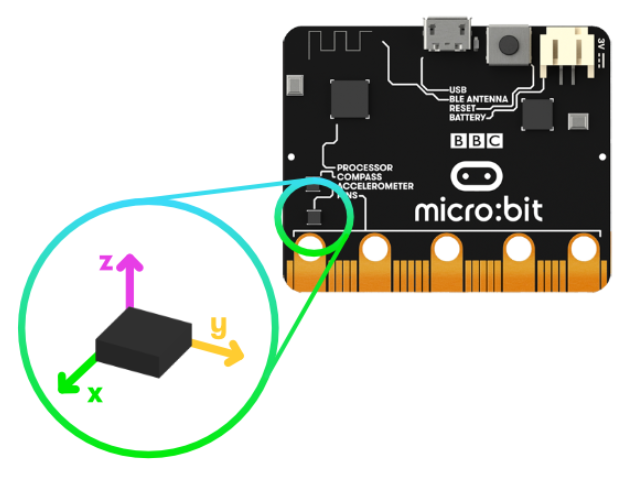{width=50%}

## Les événements

Makecode permet de détecter des événements, c'est à dire des actions qui se produisent dans le monde réel, et d'effectuer des actions diverses lorsque l'événement est détecté. Par exemple, on pourrait utiliser un événement pour détecter quand un bouton est pressé, et par exemple afficher un message sur l'écran de la micro:bit quand c'est le cas, comme dans le programme ci-dessous.

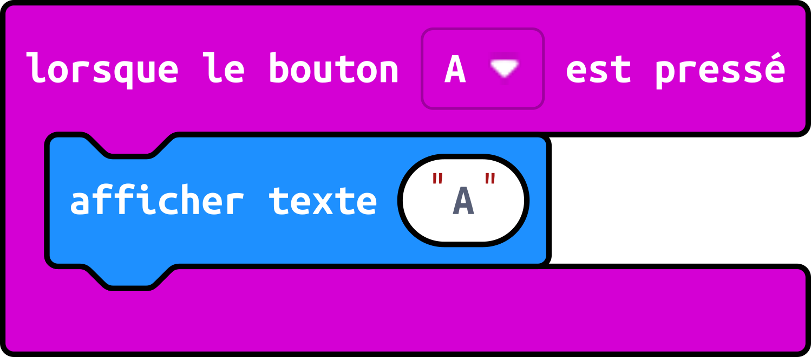{width=50%}

\newpage

Ici, le bloc `lorsque le bouton [A] est pressé` contient le bloc `afficher texte ("A")`, ce qui veut dire que si le bouton A est pressé, le texte "A" sera affiché sur l'écran de la micro:bit.

\tipbox{\fontspec{Space Grotesk} \fontsize{12}{14} N'hésitez pas à tester le programme sur votre propre carte et à expérimenter avec différents événements. Les blocs d'événements sont disponibles dans la catégorie \texttt{Entrées}.}

## Challenge 2 - Secouer la carte pour lancer le dé

L'objectif de ce challenge est maintenant de lancer le dé lorsque la carte est secouée en détectant l'événement de secousse, et plus au démarrage du programme.

\hintbox{ Vous devez remplacer le bloc \texttt{au démarrage} par un bloc d'événement qui détecte les secousses de la carte.}

\hintbox{ Le bloc que vous devez utiliser s'appelle \texttt{lorsque [secouer]}.}

![Le bloc `lorque [secouer]`](images/png/bloc_secouer.png){width=25%}

# Prendre en main le servomoteur

## Le servomoteur

Un servomteur est un moteur électrique qui peut être être orienté dans une direction précise. Certains peuvent faire des tours complets, tandis que d'autres se contentent de faire des demi-tours (ce sont eux que nous utiliserons).\ 

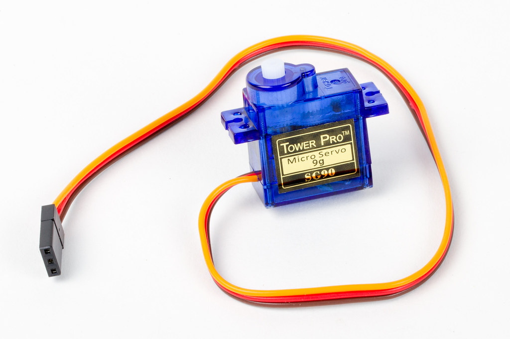{width=50%}

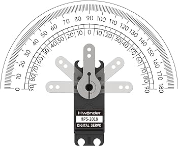{width=50%}

Comme on peut le voir sur la figure 5, un servommoteur se commande à l'aide de 3 fils : un pour l'alimentation, ici en rouge (+), un pour la masse, ici en marron (-), et un pour la commande, ici en jaune. Pour connecter un servomoteur à la micro:bit, il faut utiliser les câbles Dupont et les pinces crocodiles fournis, de la manière suivante : 

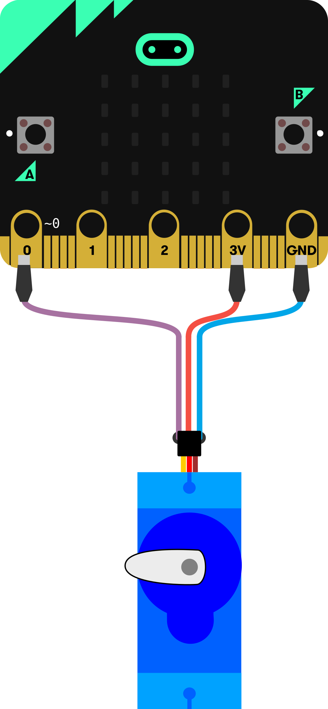{width=50%}

\newpage

## Challenge 3 - Faire le montage

En respectant le schéma ci-dessus, vous devez connecter le servomoteur à la micro:bit. Pour tester que le montage est correct, vous pouvez utiliser le programme suivant, qui fait tourner le servomoteur de 180 degrés (un demi tour) dans un sens, puis dans l'autre.

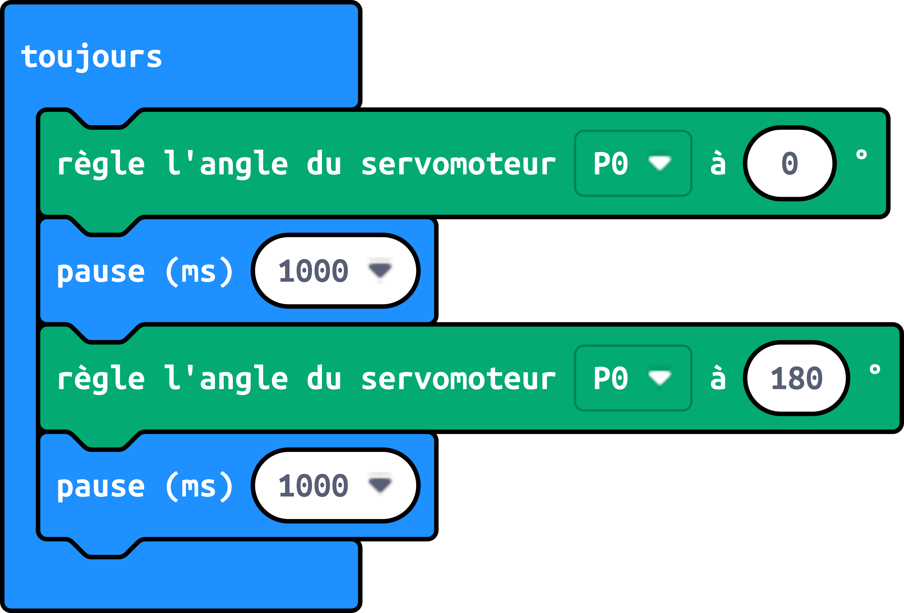{width=50%}

\hintbox{ Si le servomoteur ne tourne pas, vérifiez que les fils sont bien connectés fermement, et que vous n'avez pas fait d'erreur en recopiant le programme.}

\hintbox{ Si le servomoteur ne tourne toujours pas, vérifiez bien que les fils sont connectés dans le bon ordre.}

\hintbox{ Le fil rouge du servomoteur doit être connecté à la broche 3V de la micro:bit, le fil marron à la broche GND, et le fil jaune à la broche 0.}

## Challenge 4 - Faire tourner le servomoteur

Maintenant que vous avez réussi à connecter le servomoteur à la micro:bit, vous allez devoir faire en sorte que toutes les secondes le servomoteur s'oriente dans une direction aléatoire comprise entre 0 et 180°.

\hintbox{En réutilisant et en combinant les blocs des deux challenges précédents, vous devriez arriver au résultat voulu.}

\hintbox{Le bloc permettant de faie tourner le servomoteur se trouve dans la catégorie \texttt{Servos} et se nomme \texttt{règle l'angle du servmoteur [P0] à ( )}}

\hintbox{Le bloc permettant d'attendre se nomme \texttt{pause (ms) ( )} et se trouve dans la catégorie \texttt{Base}. Il permet d'attendre un certain nombre de millisecondes (mettre 1000 comme valeur dans le bloc fait une pause de 1 seconde).}

# Afficher le résultat grâce au servomoteur

Plutôt que de passer par l'écran de la micro:bit pour afficher le résultats du lancer de dé, nous allons utiliser le servomoteur pour afficher le résultat. Pour cela, nous allons utiliser le cadran numéroté de 1 à 6 fourni, qu'il faudra clipser sur le servomoteur comme ceci :

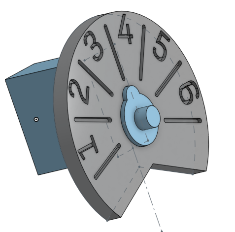{width=50%}

## Positionner correctement l'aiguille sur l'axe du servomoteur

Le but du jeu est de faire tourner le servomoteur de manière à ce que l'aiguille fournie, une fois montée sur l'axe du servomoteur, pointe vers le numéro correspondant au résultat du lancer de dé. Le problème est que lorsque le servomoteur n'est pas alimenté, on ne connait pas sa direction, Donc si on fixe l'aiguille sur l'axe du servomoteur sans vérifier l'angle dans lequel se trouve le servomoteur, l'aiguille pourrait pointer dans la mauvaise direction.
 
## Challenge 5 - Positionner l'aiguille

Vous devez écrire un programme qui permette de "calibrer" le servomoteur, c'est-à-dire de le mettre dans une position connue à l'avance, pour ensuite pouvoir y fixer l'aiguille de sorte qu'elle pointe dans la bonne direction.

\hintbox{ Pour ce challenge, vous devez utiliser le bloc \texttt{tourner le servomoteur à () degrés} pour mettre le servomoteur dans une position connue (par exemple 0 degrés). Vous pouvez ensuite fixer l'aiguille sur l'axe du servomoteur, de sorte qu'elle pointe vers l'extrémité gauche du cadran.}

## Challenge 6 - Afficher le résultat

Vous devez maintenant écrire un programme qui, lorsque le logo de la micro:bit (le symbole {height=12pt}\ doré présent en haut au centre de la carte) est touché (parce que secouer la carte comme on le faisait précédemment risque de défaire le montage avec le servomoteur), génère un nombre aléatoire entre 1 et 6, et fait tourner le servomoteur de manière à ce que l'aiguille pointe vers le numéro correspondant au résultat du lancer de dé.

\hintbox{ Tout comme pour le challenge 2, vous devez remplacer le bloc \texttt{au démarrage} par un bloc d'événement qui détecte le toucher du logo de la micro:bit.}

\hintbox{ Le bloc d'événement que vous devez utiliser s'appelle \texttt{lorsque [logo] est touché}.}

\hintbox{ Vous devez utiliser le bloc \texttt{tourner le servomoteur à () degrés} pour faire tourner le servomoteur de manière à ce que l'aiguille pointe vers le numéro correspondant au résultat du lancer de dé.}

\hintbox{Pour déterminer quel angle donner au servomoteur pour chaque numéro, vous pouvez utiliser plusieurs méthodes : faire correspondre chaque résultat possible du dé (1, 2, 3, 4, 5, 6) à un angle donné, ou bien des calculs mathématiques. Nous utiliserons ici la première méthode qui est plus simple.}

\hintbox{Pour vérifier si le nombre généré aléatoirement est 1, 2 .. ou 6, vous allez tout d'abord devoir stocker le nombre généré dans une variable, c'est-à-dire une sorte de boîte dans laquelle on peut mettre des valeurs pour les utiliser plus tard. Pour ce faire, vous devez aller dans la catégorie \texttt{Variables}, cliquer sur le bouton \texttt{Créer une variable}, et donner un nom à votre variable (par exemple \texttt{resultat}). Ensuite, en utilisant le bloc \texttt{définir [ ] à ( )}, vous pourrez enregistrer dans la variable sélectionnée la valeur voulue.}

\importantbox{\fontspec{Space Grotesk} \fontsize{12}{14} Si vos n'utilisez pas de variable dans votre programme, chaque fois que vous utiliserez le bloc \texttt{choisir au hasard de (1) à (6)}, un nouveau nombre sera généré, et vous ne connaîtrez plus le nombre aléatoire généré précédemment.}

![Le bloc `définir [ ] à ( )`](images/png/bloc_definir.png){width=25%}

\hintbox{Ensuite, pour vérifier si le nombre généré est 1, 2, 3, 4, 5 ou 6, vous pouvez utiliser des blocs de condition, qui permettent d'exécuter des blocs de code différents en fonction de si une condition est vraie ou fausse. Ces blocs se trouvent dans la catégorie \texttt{Logique} et se nomment \texttt{si < > alors ... sinon ...}. En cliquant sur le bouton \texttt{+} en bas du bloc, vous pouvez ajouter autant de conditions que vous voulez en rajoutant des blocs \texttt{sinon si < > alors ...}.}

{width=25%}

\hintbox{En utilisant les blocs \texttt{si < > alors ... sinon ...}, vous pouvez faire en sorte que si le nombre généré est 1, le servomoteur tourne de manière à ce que l'aiguille pointe vers le numéro 1, si le nombre généré est 2, le servomoteur tourne de manière à ce que l'aiguille pointe vers le numéro 2, et ainsi de suite.}

\hintbox{Tous les chiffres du cadran sont espacés de 30° (180°/6 = 30°). De plus, le chiffre 1 étant placé au centre de son segment, il est nécessaire de décaler l'aiguille de 15° pour qu'elle pointe correctement vers le numéro 1. Donc pour que l'aiguille pointe vers le numéro 1, il faut que le servomoteur soit à 15°, pour que l'aiguille pointe vers le numéro 2, il faut que le servomoteur soit à 45°, et ainsi de suite.}

## Challenge 7 - Afficher le résultat - version avancée

\hardbox{Ce challenge est plus difficile que les précédents, il est donc optionnel.}

Vous devez maintenant écrire un programme faisant la même chose que le challenge 6, mais cette fois sans utiliser de bloc de condition. Vous devrez utiliser une formule mathématique pour calculer l'angle à donner au servomoteur à partir du nombre généré aléatoirement.

\hintbox{Il est conseillé de créer une nouvelle variable appelée \texttt{angle} pour stocker l'angle à donner au servomoteur.}

\hintbox{L'angle minimum à donner au servomoteur est 15, car le chiffre 1 est placé au centre de son segment.}

\hintbox{Ensuite, il faut ajouter à cet angle 30 fois le nombre généré aléatoirement moins 1. en effet, si le nombre généré est 1, il faut ajouter 0 à 15 pour obtenir 15°, si le nombre généré est 2, il faut ajouter 30 à 15 pour obtenir 45°, et ainsi de suite.}

\newpage

\pagenumbering{roman}

# Annexes{.unnumbered}

## Challenge 1 - Solution{.unnumbered .unlisted}

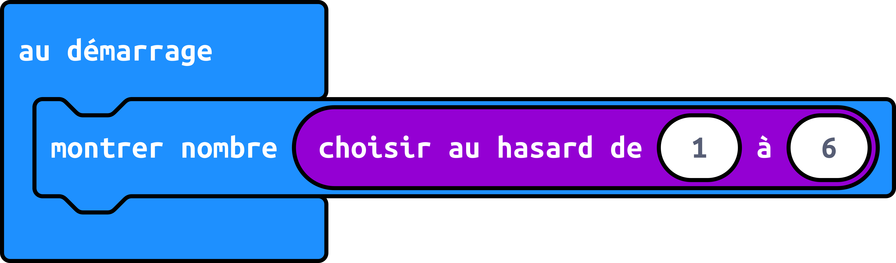{height=25%}

Ici, il suffit de modifier les nombres dans le bloc `choisir au hasard de (1) à (2)` pour qu'ils soient compris entre 1 et 6, et le tour est joué!

\newpage

## Challenge 2 - Solution{.unnumbered .unlisted}

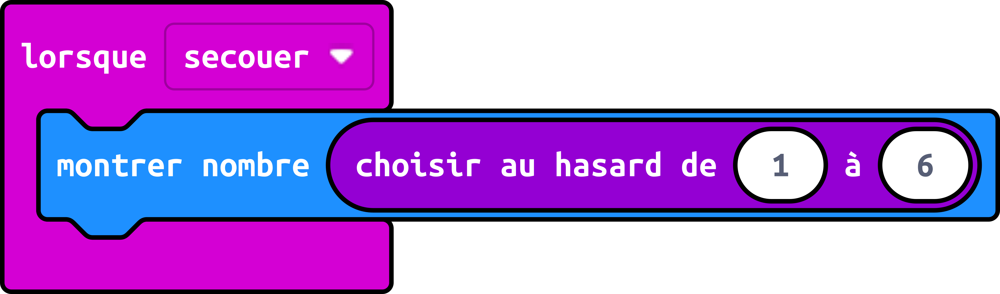{height=25%}

Ici, il faut remplacer le bloc `au démarrage` par le bloc `lorsque [secouer]` pour que le dé soit lancé lorsqu'on secoue la carte.

\newpage

## Challenge 4 - Solution{.unnumbered .unlisted}

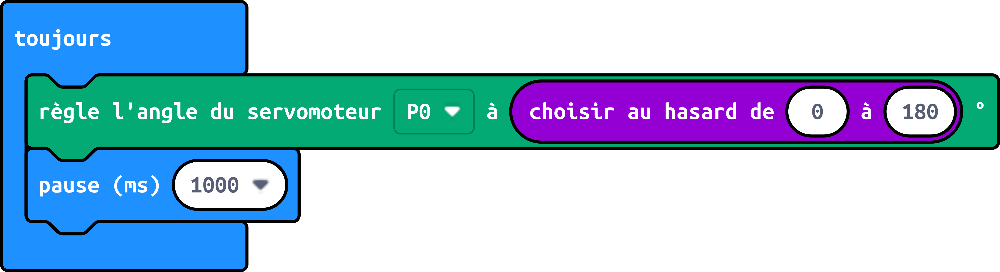{height=25%}

En combinant les blocs des challenges 2 et 3, à savoir le bloc `choisir au hasard entre ( ) et ( )`, le bloc `règle l'angle du servomoteur [P0] à ( )` et le bloc `pause (ms) ( )`, on obtient le programme voulu.

\newpage

## Challenge 5 - Solution{.unnumbered .unlisted}

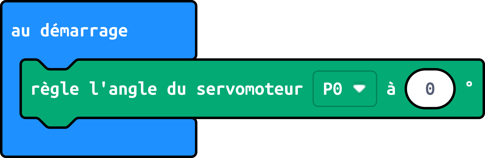{height=25%}

En positionnant le servomoteur à 0 degrés, on peut fixer l'aiguille sur l'axe du servomoteur de manière à ce qu'elle pointe vers l'extrémité gauche du cadran. On aurait pu aussi positionner le servomoteur à 180 degrés, mais dans ce cas il aurait fallu fixer l'aiguille de manière à ce qu'elle pointe vers l'extrémité droite du cadran.

\newpage

## Challenge 6 - Solution{.unnumbered .unlisted}

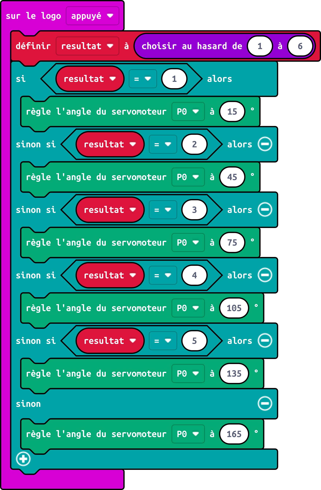{height=50%}

En premier lieu, on enregistre le résultat du lancé de dé dans une variable, puis on vérifie si le résultat est 1, 2, 3, 4, 5 ou 6, et on fait tourner le servomoteur de respectivement 15, 45, 75, 105, 135 ou 165 degrés pour que l'aiguille pointe vers le numéro correspondant.

\newpage

## Challenge 7 - Solution{.unnumbered .unlisted}

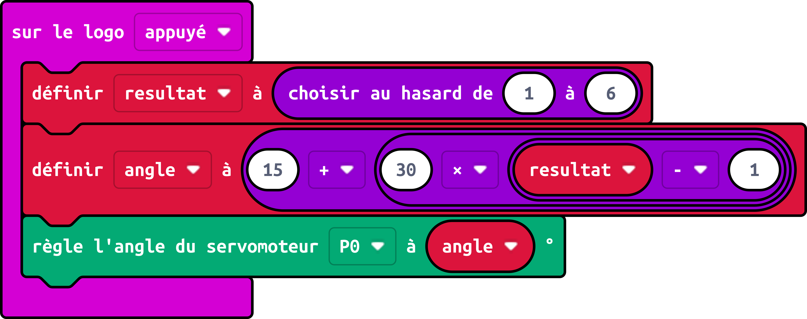{height=25%}

En utilisant une formule mathématique, on peut calculer l'angle à donner au servomoteur à partir du nombre généré aléatoirement. On crée une variable \texttt{angle} pour stocker l'angle à donner au servomoteur, et on lui donne la valeur 15 + 30 * (\texttt{resultat} - 1).