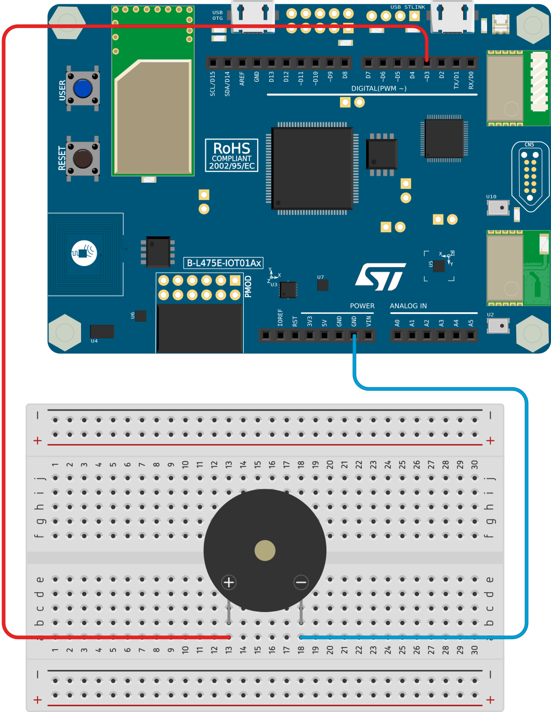
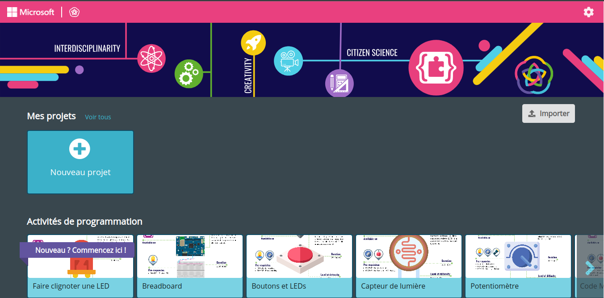
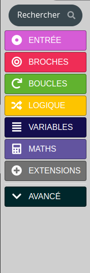
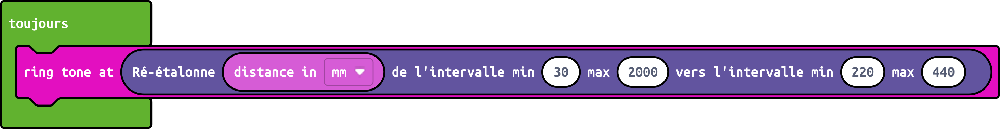
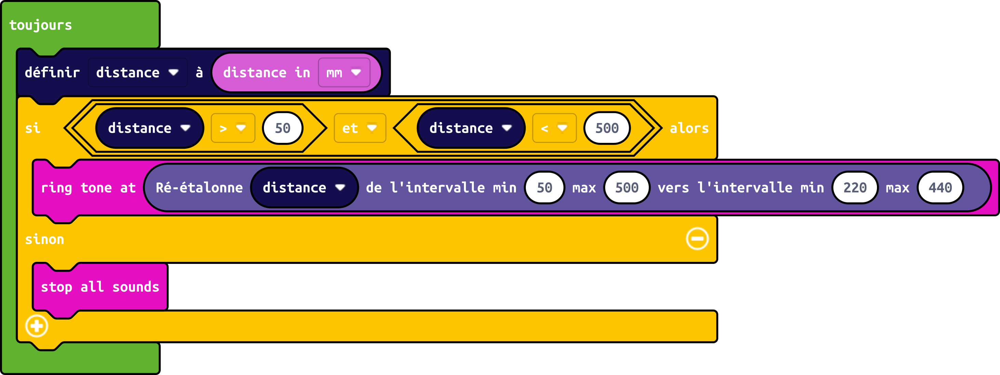

\tableofcontents

# Présentation

Le thérémine est un instrument de musique inventé par Léon Theremin en 1919. Il est composé de deux antennes, l'une servant à contrôler la hauteur du son, et l'autre servant à contrôler le volume.\
Nous allons nous inspirer de cet instrument pour créer un instrument similaire basé sur une carte électronique STM32 IoT Node, qui sera capable de jouer des notes de musique en fonction de la distance entre la main et un capteur de distance intégré à la carte.

## Liste du matériel

Afin de réaliser l'instrument, plusieurs composants électroniques vont vous être fournis : 

- Une carte électronique [STM32 IoT Node](https://www.st.com/en/evaluation-tools/b-l475e-iot01a.html)
- un buzzer
- une breadboard
- des câbles Dupont

# Fabrication de l'instrument

## Le capteur de distance

La carte électronique fournie est équipée d'un capteur de distance nommé `VL53L0X`, qui, en analysant la différence entre la lumière infrarouge émise par le capteur et la lumière infrarouge réfléchie par un obstacle, est capable de mesurer la distance entre l'obstacle et le capteur.\
Ce capteur est capable de mesurer des distances comprises entre 3cm et 2m, avec une précision de 1mm.\

Le capteur de distance est déja soudé sur la carte, il s'agit du composant noir situé en haut à gauche de la carte, à côté de la LED bleue.

{width=75%}

## Le buzzer

Le buzzer, en revanche, n'est lui pas soudé à la carte. Pour le connecter à la carte, il faut le brancher sur les broches `D3` et `GND` de la carte, au moyen de câbles Dupont et de la breadboard.\

{width=75%}

\warningbox{\fontspec{Clara} \fontsize{12}{14} Le buzzer a une polarité, c'est-à-dire qu'il faut le brancher dans le bon sens. Même si les marques de polarité sont souvent difficiles à voir, il est recommandé de brancher le buzzer dans le sens indiqué sur l'image ci-dessus.}

# Programmation de la carte

La programmation de la carte va se faire au moyen de Makecode Let's STEAM, un environnement de programmation visuel basé sur des blocs, qui permet de programmer la carte par blocs, c'est à dire des instructions représentées sous forme de briques pouvant être assemblées les unes aux autres.\

## Créer un projet Makecode

Pour créer un programme, il faut se rendre sur le site [https://makecode.letsteam.fr](https://makecode.letsteam.fr).\
Ensuite, il faut cliquer sur le bouton `Nouveau projet`, puis donner un nom au projet.\

{width=75%}

## Ajouter l'extension `music`

Avant de commencer à programmer, vous aurez besoin d'ajoutez une extension au projet, qui vous permettra d'utiliser les blocs relatifs au son.\
Pour cela, il vous faut cliquer sur le bouton `Extensions`, puis chercher et sélectionner l'extension nommée `music`.\

{height=40%}

## Programmer la carte

L'objectif du programme va être de "transformer" la distance mesurée en fréquence sonore, qui correspond à la hauteur du son.\
Pour cela, vous aurez besoin de plusieurs blocs :

Tout d'abord, vous aurez besoin des blocs `au démarrage` et `toujours`, qui sont présents par défaut dans le programme.\

{width=50%}

Le bloc `au démarrage` va exécuter les instructions qu'il contient une seule fois, au démarrage du programme, tandis que le bloc `toujours` va exécuter les instructions qu'il contient en boucle, c'est-à-dire en continu, tant que le programme est en cours d'exécution.\

Ensuite, vous aurez besoin du bloc permettant de mesurer la distance avec le capteur : `distance in [mm]`, qui se trouve dans la catégorie `Entrée`.

![Le bloc `distance en [mm]`](images/png/bloc_distance.png){width=50%}

Vous aurez également besoin de convertir la distance en fréquence sonore. Pour cela, nous allons utiliser un bloc de la section `Maths` nommé `Ré-étalonne ( ) de l'intervale min ( ) max ( ) vers l'intervalle min ( ) max ( )`. Ce bloc permet de convertir une valeur d'un intervalle vers un autre intervalle. Dans notre cas, l'intervalle de départ sera l'intervalle de distance du capteur, c'est-à-dire `[30, 2000]`, et l'intervalle d'arrivée sera la tessiture voulue, c'est à dire l'écart entre la note la plus grave et la note la plus aigüe que l'on veut pouvoir jouer.

{width=90%}

Enfin, nous aurons besoin d'un bloc permettant de jouer une note, `ring tone ( )` qui se trouve dans la catégorie `Music`. Ce bloc prend en paramètre la fréquence de la note à jouer. 

{width=50%}

Comment assembleriez vous ces blocs pour obtenir le résultat voulu ?\ 

\notebox{\fontspec{Clara} \fontsize{12}{14} Pour tester votre programme, branchez la carte à votre ordinateur à l'aide d'un câble micro-USB via le port `USB ST-LINK` situé en haut à droite de la carte. Cliquez sur télécharger dans Makecode pour télécharger le programme, puis copiez le dans la carte qui devrait apparaître comme un périphérique USB dans l'explorateur de fichiers. Une fois la copie terminée, le programme devrait se lancer automatiquement.}

\tipbox{\fontspec{Clara} \fontsize{12}{14} Si vous n'arrivez pas au résultat voulu, vous pouvez vous référer à l'annexe A de l'activité.}

## Programmer la carte - Suite et fin

Vous avez réussi à programmer la carte pour qu'elle joue une note en fonction de la distance mesurée. Cependant, vous avez remarqué que la note est jouée en continu, ce qui n'est pas très agréable à l'oreille. De plus, comme la portée du capteur est assez grande, il est difficile de pouvoir jouer sur toute la tessiture de l'instrument.\
Nous allons régler ces problèmes en définissant une zone de jeu, c'est-à-dire deux distances, une minimale et une maximale, qui permettront de définir la zone dans laquelle il sera possible de jouer.\

Pour implémenter cette zône de jeu, nous allons avoir besoin du bloc `si < > alors sinon` présent dans la catégorie `logique`. 

{width=50%}

Ce bloc permet d'exécuter des instructions si une condition est remplie, et d'autres instructions si cette même condition n'est pas remplie. Une condition est un bloc avec les extrêmités pointues, qui peut avoir comme valeur soit `vrai`, soit `faux`. Dans notre cas, nous allons utiliser ce bloc pour vérifier si la distance mesurée est comprise entre la distance minimale et la distance maximale, et si c'est le cas, jouer la note correspondante.\

Pour définir la condition, nous allons utiliser 3 blocs logiques : le bloc `et`, le bloc `>` et le bloc `<`. 

{width=90%}

Le bloc `et` permet de vérifier si deux conditions sont remplies, le bloc `>` permet de vérifier si une valeur est supérieure à une autre, et le bloc `<` permet de vérifier si une valeur est inférieure à une autre. Ainsi, nous pourrons vérifier si la distance mesurée est supérieure à la distance minimale, et si elle est aussi inférieure à la distance maximale.\

Enfin, nous allons avoir d'une variable. Une variable est une donnée stockée dans le programme, qui peut être réutilisée à plusieurs endroits. Dans notre cas, nous allons utiliser une variable nommée `distance`, qui va correspondre à chaque tour de la boucle `toujours` à la distance mesurée par le capteur.\
Pour créer une variable, aller dans la catégorie `variables`, puis cliquez sur le bouton `Créer une variable`. Donnez un nom à la variable, puis cliquez sur `OK`. De nouveaux blocs devraient apparaître dans la catégorie `variables` : `définir [variable] à ( )`, `modifier [variable] de ( )`et `variable`, `variable` étant le nom de la variable que vous venez de créer.\

![Les blocs `définir [variable] à ( )`, `modifier [variable] de ( )`et `variable`](images/png/blocs_variables.png){width=90%}

Comment assembleriez vous ces blocs pour ne pouvoir jouer que dans la zone de jeu ?\

\notebox{\fontspec{Clara} \fontsize{12}{14} Pour stopper tous les sons, vous pouvez utiliser le bloc `stop all sounds` présent dans la catégorie `Music`.}

\tipbox{\fontspec{Clara} \fontsize{12}{14} Si vous n'arrivez pas au résultat voulu, vous pouvez vous référer à l'annexe B de l'activité.}

\newpage

\pagenumbering{roman}

# Annexes{.unnumbered}

## Annexe A - Solution Programme {.unlisted .unnumbered}

{width=100%}

Dans ce programme, on utilise simplement le bloc `ring tone ( )` dans le bloc `toujours`, et on lui donne en paramètre la valeur de la distance mesurée, qui a été convertie en fréquence sonore au moyen du bloc `Ré-étalonne ( ) de l'intervale min ( ) max ( ) vers l'intervalle min ( ) max ( )`. L'intervalle de départ est `[30, 2000]`, et l'intervalle d'arrivée est `[220, 440]`, qui correspond à une octave (de La à La dans ce cas ci).\

\newpage

## Annexe B - Solution Programme{.unlisted .unnumbered}

{width=100%}

Dans ce programme, on utilise le bloc `si < > alors sinon` pour vérifier si la distance mesurée est comprise entre la distance minimale et la distance maximale. Si c'est le cas, on joue la note correspondante, sinon, on arrête tous les sons.\
On utilise également une variable `distance` qui correspond à la distance mesurée par le capteur, et qui est mise à jour à chaque tour de la boucle `toujours` au moyen du bloc `définir [variable] à ( )`.\
En effet, si on utilise le bloc `distance in [mm]` à chaque fois que l'on veut utiliser la distance mesurée, une nouvelle mesure sera effectuée, ce qui n'est pas souhaitable dans la mesure où si vous déplacez l'obstacle et modifiez la distance, vous aurez en quelque sorte deux mesures de la distance différente.\

\newpage

## Annexe C - Références{.unlisted .unnumbered}

Cette ressource est inspirée et tirée de l'activité Thérémine du projet Erasmus+ [Let's STEAM](https://www.lets-steam.eu/?lang=fr).\

